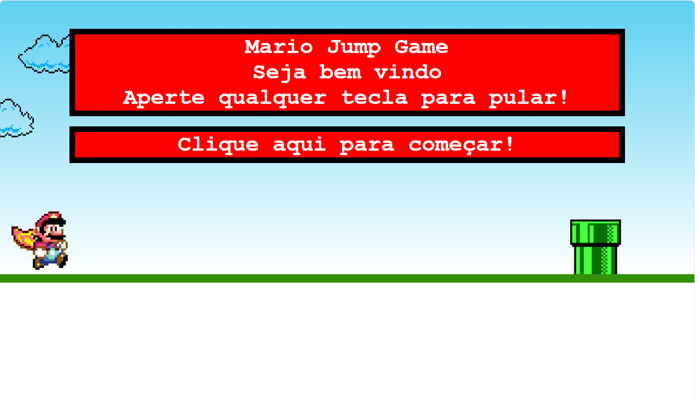

<h1 align="center">Jogo do Mario em JavasScript</h1>

 ## Nesse repositório você encontra um jogo similiar ao dino do Chrome utilizando o tema do Mario.

# :scroll: Uma breve descrição:

### Este projeto foi desenvolvido para treinar conceitos de JavaScript e animações em CSS bem como conteinerização de aplicações com a utilização do Docker.

As animações de movimento de cenário foram feitas apenas em **CSS**, a animação de pulo e de game over foram feitas em **Javascript**!  
 
---
Para jogar basta clonar o repositório e rodar o ` index.html ` no seu navegador. Se você possui o Docker instalado na sua máquina, pode clonar o [Repositório do Docker](https://hub.docker.com/r/andresizer/mariojs) e criar um container para jogar o jogo!

# :notebook_with_decorative_cover: Telas do jogo e como jogar

- O jogo é bem simples e intuitivo. Para jogar, basta apertar qualquer tecla do teclado para pular o cano;

- O jogador perde se bater no cano
- Quando o jogador perde, pode reiniciar o jogo. O maior placar ficará salvo.
  

----------

